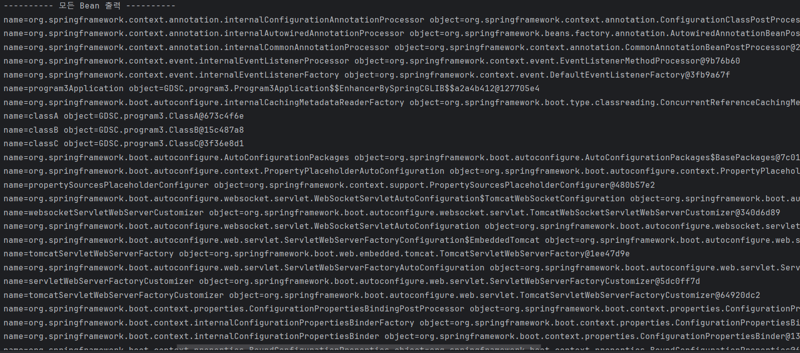
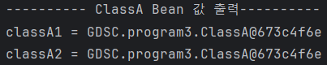

## 1. Spring Bean이란?
Spring IoC 컨테이너가 관리하는 자바 객체로서 컨테이너에 의해 생명주기가 관리되는 객체

## 2. Spring Bean을 등록하는 방법
### 첫 번째 방법: 컴포넌트 스캔과 자동 의존관계 설정
#### 컴포넌트 스캔 원리
- @Component 애노테이션이 있으면 스프링 빈으로 자동 등록된다.
- @Controller 컨트롤러가 스프링 빈으로 자동 등록된 이유도 컴포넌트 스캔 때문이다.
- @Component를 포함하는 다음 애노테이션도 스프링 빈으로 자동 등록된다.
  - @Controller
  - @Service
  - @Repository
- 생성자에 @Autowired를 사용하면 객체 생성 시점에 스프링 컨테이너에서 해당 스프링 빈을 찾아서
  주입한다. 생성자가 1개만 있으면 @Autowired는 생략할 수 있다.
- 스프링은 스프링 컨테이너에 스프링 빈을 등록할 때, 기본으로 싱글톤으로 등록한다(유일하게 하나만
  등록해서 공유한다) 따라서 같은 스프링 빈이면 모두 같은 인스턴스다.

### 두 번째 방법: 자바 코드로 직접 스트링 빈 등록
- @Configuration, @Bean을 사용하면 된다.
- 필드 주입, setter 주입, 생성자 주입 이렇게 3가지 방법이 있다.

## 3. 로그 캡쳐

